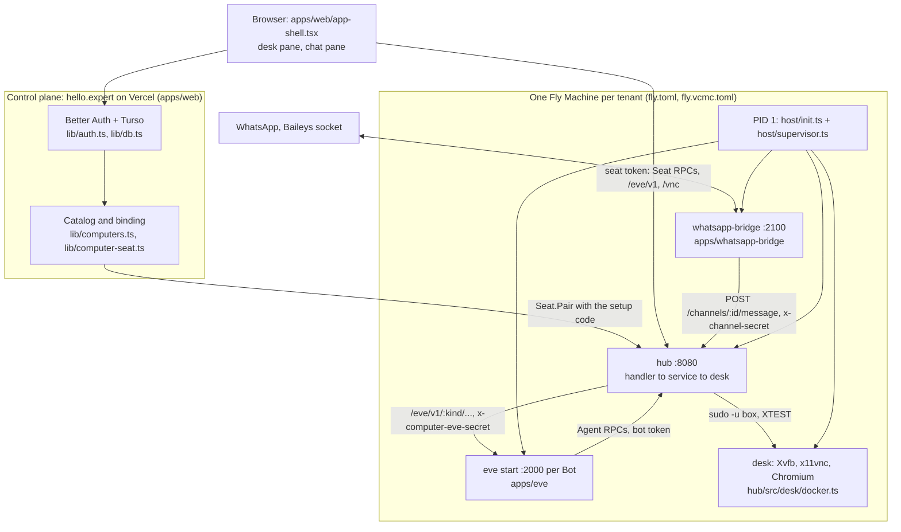
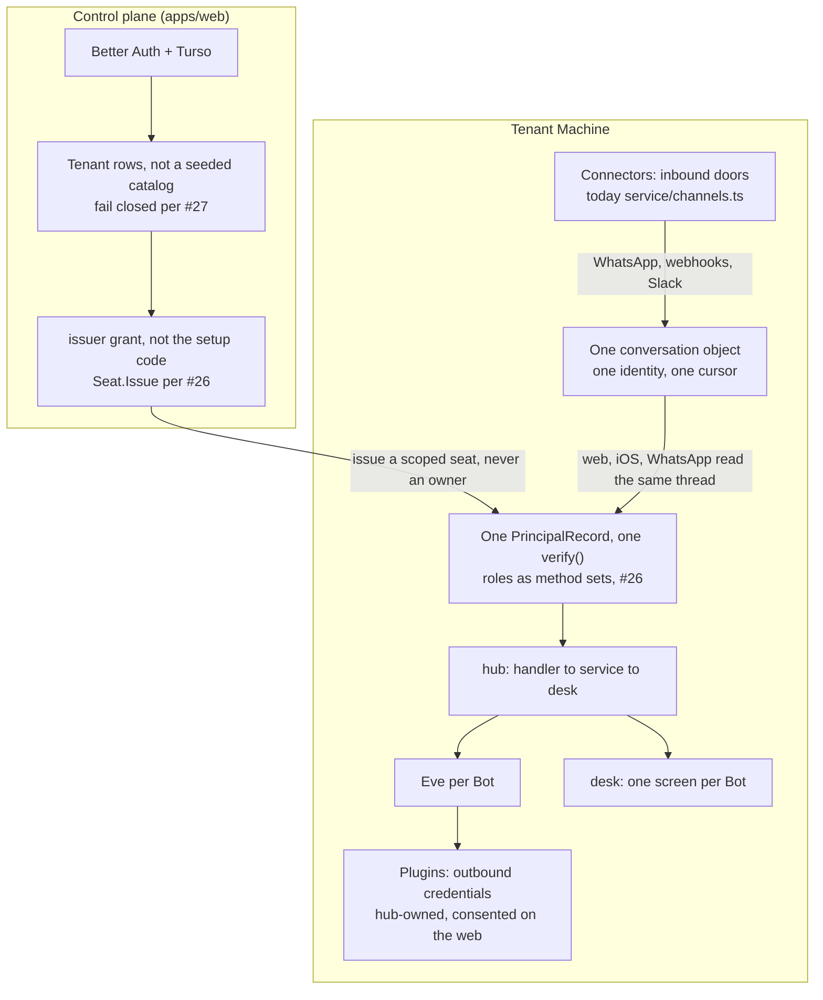

# Architecture

Date: 2026-09-03, against `main` at `1e280ad`. Scope: the whole system as it is deployed, the seams that are load-bearing, and the shape the next few changes are aimed at. Companion to [`AUDIT.md`](AUDIT.md) (what is broken and ranked) and [`WHATSAPP-PARITY.md`](WHATSAPP-PARITY.md) (the order of work). This document answers a different question from either: not what to fix and not what to build next, but why the pieces are cut where they are, so that a change lands on the right side of a boundary.

Four branches are in flight against this text and are named where they touch it: [#26](https://github.com/mblode/expert/pull/26) (one principal model), [#27](https://github.com/mblode/expert/pull/27) (fail closed on the computer binding), [#28](https://github.com/mblode/expert/pull/28) (one supervised Eve launch path), [#29](https://github.com/mblode/expert/pull/29) (one outbound WhatsApp envelope). None of them is merged, so everything below describes `main`.

## 1. Two planes

There is a shared control plane and there are single-tenant computers, and almost every design question in this repository is really a question about which of the two owns a thing.

The control plane is `apps/web`, a Next.js app on Vercel serving hello.expert. It holds identity (Better Auth over a Drizzle adapter in `apps/web/lib/auth.ts`), the database (libSQL/Turso in `apps/web/lib/db.ts`, with `user`, `session`, `computer`, `computer_seat` and `invite` tables), the catalog of which computers exist, and the setup code for each one. It holds no pixels, no files, no agent and no model call. It is a directory and a credential broker.

A computer is one Fly Machine with one volume, one hub, one desk, one Eve process per Bot and one WhatsApp bridge. Blode is `mblode-computer` (`fly.toml`), Vibey is `vcmc-computer` (`fly.vcmc.toml`), both shared-cpu-2x with 2 GB, both suspending to zero when idle. The Machine is the unit of isolation, the unit of billing, the unit of failure and the unit of deploy, all at once, and that coincidence is the reason the architecture stays this simple.

PID 1 on the guest is `apps/hub/src/host/init.ts` running under tini via `deploy/fly/guest-entrypoint.sh`. It is the only process on the box that changes uid: it fixes up the volume, mints or refuses to mint the setup code, writes the hub-owned secrets at 0600, then hands everything to `host/supervisor.ts`, which starts `desk-up` once as `box`, one `eve start` per roster Bot as `box`, the bridge as `hub` and the hub as `hub`, each with a restart backoff (1 s to 30 s, reset after 60 s stable) and an optional health probe. The supervisor mirrors its view to `/run/computer/status.json` and `GET /healthz` reports it, so a Machine with a dead X server no longer answers `ok`. Note the asymmetry in that health check: `ok` reflects every child, but the endpoint is always HTTP 200 while the hub itself answers, deliberately, so that a crash-looping Eve does not make Fly restart the whole Machine.

The uid split is the other half of that. The hub used to run as `box`, which meant the model's `shell` could read the roster, the seat tokens and the Baileys credentials, because they were all readable by the user the model runs as. Now `/workspace/.computer` is hub-owned at 0700 and the hub reaches the desk through `sudo -u box` (`asBox` in `apps/hub/src/desk/docker.ts`, enabled by `COMPUTER_RUN_AS`). `init.ts` also strips `COMPUTER_SETUP_CODE`, `WHATSAPP_BRIDGE_SECRET` and `FLY_API_TOKEN` from every child environment, because Eve shares uid `box` with the model's shell and anything in Eve's environ is the model's too.

Two things in that picture are easy to misread. The browser talks to the hub directly, cross-origin, not through Vercel: the control plane hands out a seat token and then gets out of the way, which is why `corsHeaders()` in `apps/hub/src/handler/router.ts` is `*` and why every hub call is bearer-authenticated with nothing reading cookies. And Eve is a child of the guest that calls back into the hub over loopback with its own bot token; it is not a peer service and it is not addressable from outside.

## 2. The account is the tenant boundary

`apps/web/lib/computers.ts` binds an email address to one computer. `COMPUTER_BINDINGS` is a `email:computerId` list, `parseComputerBindings` reads it, `defaultComputerId` resolves an address to a computer id and `accessibleComputers` decides what the switcher may show. `computer-seat.ts` then Pairs that computer's hub with its own setup code (`COMPUTER_SETUP_CODE` for Blode, `COMPUTER_SETUP_CODE_VCMC` for Vibey) and stores the resulting seat token in `computer_seat`, keyed by user, so a later session reuses the token instead of Pairing again.

The consequence people get wrong: Vibey is a separate login on a separate Machine, not a Bot on Blode. A second Bot would put the VCMC agent in the same `/workspace`, under the same box user, driving screens of the same desk (see section 3). A second computer is a second Fly app, a second volume, a second setup code and a second hub. That is the only boundary in the system that actually holds, so anything that needs separation buys a Machine.

On `main` both lookups fail open, and this is the single most consequential correctness gap in the control plane. `defaultComputerId` falls back to the hardcoded `DEFAULT_COMPUTER_ID` of `"blode"` for any address with no binding, so an address that passed `AUTH_ALLOWED_EMAILS` but that nobody remembered to bind lands on Blode and Pairs an owner seat there. `isComputerOperator` treats an unset `COMPUTER_OPERATOR_EMAILS` as every signed-in user, so in the default configuration everyone is an operator, `accessibleComputers` returns the whole catalog, and the binding branch never runs at all. [#27](https://github.com/mblode/expert/pull/27) closes both together: no binding resolves to nothing rather than to Blode, an unset operator list means nobody, and `DEFAULT_COMPUTER_ID` survives only as an explicit opt-in. Fixing either one alone would leave the hole open, which is why they are one change.

There is a structural fact underneath that, which no PR in flight addresses: the Vercel deployment holds the setup code for every computer in the catalog, and a setup code is a permanent, unrotated owner credential for that Machine. The blast radius of the control plane is therefore every tenant on it, and shrinking that is what `Seat.Issue` in [#26](https://github.com/mblode/expert/pull/26) is for, where a control plane holds an `issuer` grant that can hand out working seats but can never mint an owner.

## 3. A Bot is not a security boundary

`apps/hub/src/service/bots.ts` says it in the type comment, and the code means it literally: "One shared box, many Bots, one screen (window index = X display) per Bot. The agent token identifies the Bot; the Bot maps to its display hub-side. Bots are not security boundaries: same box user, shared /workspace." Policy is constructed once and passed to every Bot for the same reason.

So what a Bot actually separates is a screen, a token, a state directory (`/workspace/.bots/<id>`) and an Eve process. What it does not separate is the filesystem, the box user, browser profiles, installed packages or anything either agent can read with `shell`. Two Bots on one computer can read each other's transcripts and each other's files, and `AUDIT` P1 #9 records the sharpest version of that: any Bot can write another Bot's `transcript.jsonl` and the voice service trusts every line it restores.

The useful way to hold this is that a Bot is an org-chart noun, not a security noun. Splitting work across Bots buys parallel screens and separate conversations. It buys nothing at all against a compromised or misled agent. Anything that needs real separation is a separate account on a separate computer, which is exactly the shape Vibey already has.

## 4. The doors

Everything that reaches a tenant computer goes through the hub on `:8080`, and there are seven ways in. The router (`apps/hub/src/handler/router.ts`) refuses to register a method without an auth policy and `assertAllPolicies()` fails startup if any proto method is unregistered, so the list below is closed by construction rather than by review.

| Door            | Path                          | Credential                                                   | Checked in                                            |
| --------------- | ----------------------------- | ------------------------------------------------------------ | ----------------------------------------------------- |
| Pair            | `POST /computer.v1.Seat/Pair` | the computer's setup code                                    | `AuthRegistry.pair`, ten failures then a 60 s lockout |
| Seat RPCs       | `POST /computer.v1.Seat/*`    | a seat token, `owner` or `guest`                             | `AuthRegistry.verify`, policy `seat`                  |
| Agent RPCs      | `POST /computer.v1.Agent/*`   | a bot token from the roster                                  | `AuthRegistry.verify`, policy `agent`                 |
| Eve proxy       | `/eve/v1/*`                   | an owner seat token; the hub injects the Eve secret          | `handler/eve-proxy.ts`, `auth.isOwner`                |
| Channel ingress | `POST /channels/:id/:path`    | `x-channel-secret`                                           | `handler/channels.ts`, `ChannelRegistry.verify`       |
| Pixels          | `GET /vnc*`, the WS upgrade   | a 15 minute pixel token bound to a display, or an owner seat | `app.ts`, `auth.canViewPixels`, `vnc-proxy.ts`        |
| Public          | `GET /spec`, `GET /healthz`   | none                                                         | `router.extra`, policy `public`                       |

A few properties of that table are worth stating outright because they were each paid for.

**Pair is the one unauthenticated write**, and it hands back a permanent owner token. The lockout stops online guessing and the 1 MB body cap stops a dump, but one correct guess is still an owner credential nobody rotates (`AUDIT` P0 #10).

**Agent tokens are compared constant-time against every roster entry with no early exit on match**, and the roster is read through a closure (`agentTokens: () => bots.tokenEntries()`) so provisioning a Bot at runtime needs no auth-registry sync.

**A guest seat carries its own method allowlist and an expiry**, capped at `GUEST_MAX_TTL_MS` of 15 minutes, checked on read so a stopped sweep cannot extend one, and narrowable but never wideable past `SEAT_GUEST_METHODS` in `packages/shared`. This is also how `/roster` ends up owner-only in effect despite being registered with policy `seat`: it is not in the guest allowlist, so a guest is refused by the same check that guards the Seat RPCs.

**But nothing on the wire mints a guest.** `mintGuest` has no production caller; the only references outside `handler/auth.ts` are in `apps/hub/test/`. The invite flow that WhatsApp members are supposed to use (`apps/web/lib/invite.ts`, `grantInviteSeat`) calls `pairComputer`, which is `Seat.Pair` with the setup code, so redeeming a desk invite hands a group member a full owner seat on the tenant hub, expiring only by the web-side invite record and not by the seat itself. The mechanism for scoped seats exists and the path that needs it does not use it. That gap is the reason [#26](https://github.com/mblode/expert/pull/26) exists: it collapses seat tokens, bot tokens and the third-door checks onto one `PrincipalRecord` resolved by one `verify()`, makes roles method sets where `owner` is unrestricted and every narrower role is an explicit allowlist, moves display binding onto the record rather than the role, and adds `Seat.Issue` so a named subject can be handed a scoped seat without the setup code. Until it lands, "a seat" means "an owner" everywhere it matters.

**The channel ingress deliberately has no lockout**, unlike Pair, and the comment in `service/channels.ts` explains why: channel ids are guessable (`whatsapp-<acct>`), the route is public, so a per-id lockout would let anyone on the internet block the real bridge for a minute at a time with ten junk requests. A 256-bit secret compared in constant time is the whole defence.

**The two Eve doors end at the same place with the same header.** Both the seat-gated proxy and the channel ingress forward to the Bot's Eve on loopback with `x-computer-eve-secret`, so an Eve channel file cannot tell them apart and does not need to. They differ only in the question they ask on the way in: the proxy asks "is this the owner", the ingress asks "is this the door it claims to be".

## 5. `channel` names three things

The word is overloaded in this repository, and the three senses are genuinely different objects:

1. **A credentialed door on the hub.** `apps/hub/src/service/channels.ts` and `channels.json`: a record with an id, a kind, a Bot, a secret and an optional path allowlist. `POST /channels/<id>/<rest>` with `x-channel-secret` forwards to that Bot's Eve at `/eve/v1/<kind>/<rest>`.
2. **An eve route file.** `apps/eve/lib/channels/whatsapp.ts`, a `defineChannel` with routes, an auth check and a turn policy. The file stem is the channel id in eve's own sense, and the hub record's `kind` is what selects it.
3. **The conversational sense.** "WhatsApp is just a channel", the way `WHATSAPP-PARITY.md` uses it in its noun table: a way messages reach a Bot and replies leave it.

The first two line up by convention (`kind: "whatsapp"` finds `channels/whatsapp.ts`) and nothing enforces the correspondence; a record naming a kind with no route file gets a 404 from Eve rather than a hub-side error. That is tolerable. What is not tolerable long-term is that sense 1 is a _credential_, and calling a credential a channel makes every sentence about revocation ambiguous.

The intended rename is `connector` for sense 1, leaving `channel` to mean senses 2 and 3 only, which are the same idea at two altitudes. Nothing in the repository uses `connector` that way yet. Two things to get right when the rename happens. `WHATSAPP-PARITY.md` already spends the neighbouring word `plugin` on a remote MCP or OpenAPI connection with a human-consented credential, so `connector` must not quietly absorb that too: a connector is inbound and a plugin is outbound, and the credential points the opposite way in each. And `channels.json`, `x-channel-secret` and the `/channels/` prefix are all on deployed volumes and in the running bridge, so the rename is a migration and not a search-and-replace.

## 6. The model's voice, and where it actually comes out

The intended contract, from `api/RESEARCH.md` and `api/DESIGN.md`, is that plain model text is a private scratchpad and the human sees exactly the occurrences the model chose to send. `apps/hub/src/service/voice.ts` implements that faithfully: `Agent.SendMessage` appends an occurrence, `widget` and `secret_request` end the turn, a second send after the turn ended is a `CONFLICT`, and the turn re-opens only when the human does something. `Seat.Occurrences` pages the log and it survives a restart through the Bot's `transcript.jsonl`.

The product does not use it. Grepping for consumers turns up none: `apps/web/components/chat-pane.tsx` renders Eve's own session stream through `useEveAgent` over the `/eve/v1` proxy, and `apps/ios/Computer/Models/EveClient.swift` speaks the same Eve protocol through the same proxy. Neither client calls `Seat.Occurrences`, neither answers a widget, neither calls `ProvideSecret`. So the model's voice has **two exits and one dead end**:

- **The Eve session stream**, proxied at `/eve/v1` and gated on an owner seat, is what a human on hello.expert or iOS actually reads. It carries the model's raw assistant text, tool parts and reasoning, which is the opposite of the scratchpad contract.
- **The WhatsApp channel's synchronous `{reply}`**, in `apps/eve/lib/channels/whatsapp.ts`: the bridge POSTs a message through the hub's channel ingress, the channel drains the session's event stream to the last `message.completed`, normalises it in `outboundReply` and returns it in the HTTP response the bridge posts back to the chat. One turn, one reply, no thread on the hub side at all. The session token is `<chat jid>#<uuid>`, deliberately unique per message, so there is no in-thread conversational memory either: the agent grounds itself in the bridge's recent-message context instead.
- **The occurrence log**, written by `send_message` (`apps/eve/lib/tools/send_message.ts`), persisted per Bot, read by nobody.

This is `AUDIT` P1 #4 seen structurally rather than as a bug. Three surfaces disagree about what a conversation is: an eve session with durable state and a resume cursor, an HTTP request/response pair, and an append-only occurrence log with a seq cursor and a turn FSM. The next architectural step is to collapse them into one conversation object with one identity and one cursor, so that a WhatsApp turn, a hello.expert turn and a routine's turn are the same noun with different transports, and the turn-ending rules that today only exist in `voice.ts` apply everywhere or are dropped everywhere. Until that decision is made, do not add a fourth: [#29](https://github.com/mblode/expert/pull/29) narrowing the bridge to one outbound envelope is the right direction precisely because it reduces the count.

## 7. What is deliberately not there

Each of these is an absence someone will propose filling. Each has a trigger that would make it worth doing, and until that trigger fires, adding it is a cost with no return.

**A gateway.** Nothing sits in front of the hub. The browser calls the Fly Machine directly with a bearer token; Vercel's own API routes (`/api/computer/select`, `/api/computer/reconnect`, `/api/invite`, `/api/connections`) manipulate the binding and mint invites, they do not proxy hub traffic. This keeps VNC frames and Eve's event stream off Vercel entirely, which is the whole reason it is shaped this way. _Trigger:_ a tenant that must not expose a public hostname, or a per-tenant rate limit that cannot live on the Machine. Not "it feels tidier".

**An MCP server.** The hub does not speak MCP and `api/DESIGN.md` argues at length against the fat-MCP shape: the model's surface is five tools with one closed action union, not sixty-four tools. Eve is an MCP _client_ when `COMPUTER_MCP_URL` is set (`apps/eve/lib/connections/local.ts`), which is the direction that adds capability without widening the attack surface. _Trigger:_ a third-party harness that must drive this computer and cannot be given a bot token. Note what that implies: an MCP server would be a new door in section 4's table and needs a row there before it needs an implementation.

**Tenant tables and self-serve provisioning.** Partly present, and worth being exact about. The `computer` and `computer_seat` tables do exist in Turso, and `ensureComputerCatalog()` mirrors the catalog into them. But the catalog itself is seeded from environment variables in `computersFromEnv`, with `blode` and `vibey` written into the source, so `computer` is a cache of a hardcoded list rather than a table you can insert a tenant into. Adding a tenant today is a Fly app, a volume, a `fly.<tenant>.toml`, a setup code and a code change. `apps/hub/src/host/fly-machine.ts` can wake, suspend and stop a Machine through the Machines API, but nothing creates one. _Trigger:_ the third tenant, or the first tenant who is not a person Matt knows. At that point the catalog becomes rows and provisioning becomes a Machines API call on sign-up, and section 2's fail-closed binding has to already be in place, because self-serve provisioning on top of a fail-open binding is how one account opens another account's box.

**An adapter split.** `service/adapters.ts` (OpenAI, Claude and Gemini action shapes) was deleted in the audit pass because it had no route, and the mapping rules live in `api/RESEARCH.md` instead. The hub speaks exactly one action union and clients translate. _Trigger:_ a second first-party client with a shape the hub cannot serve. A harness that can be configured is not that trigger.

**SQLite for hub state.** The hub's state is JSON files on the volume: `bots.json`, `seats.json`, `channels.json`, `policy.json`, each written through `writeTokenFile` at 0600 with a temp-file rename. There are a handful of records in each, they are edited by hand and by `npm run bot`, and `ChannelRegistry` reads its file per call precisely so an out-of-band edit is picked up by a running hub. _Trigger:_ concurrent writers, or a query that is not "read the whole file". Both arrive together with per-principal grants and an audit trail, which is why [#26](https://github.com/mblode/expert/pull/26) explicitly keeps the storage as it is and says so: folding the stores together is mechanical once every caller speaks `Principal`, and burying a storage migration inside an auth rewrite makes the diff unreviewable.

## 8. The target shape

The direction is one identity model, one conversation, and a tenant that can be created rather than declared. Nothing here is speculative architecture: every box below is either an existing file or the named change in an open PR.

Read in order, the moves are: make the binding fail closed (#27) so that identity means something; give the hub one principal model with roles and a way to issue a scoped seat (#26) so that "a human at a screen" stops meaning "an owner of the box"; collapse the three conversation shapes of section 6 into one object so that a reply is a reply whatever carried it; rename the inbound door to `connector` once `plugin` is settled as the outbound one; and only then turn the catalog into tenant rows, because a provisioning API on top of the current binding is a hole rather than a feature.

Two invariants survive all of it, and a change that breaks either is wrong even if it is smaller. The hub is the only door and the only gate: every inbound message, every human input and every model action crosses it, so a path that bypasses the hub also bypasses policy, the seat FSM, suspend and wake, and the audit trail. And the Machine is the only isolation boundary there is: a Bot, a role, a seat and a connector all narrow what someone may do on a box they are already on, and none of them keeps them off it.
