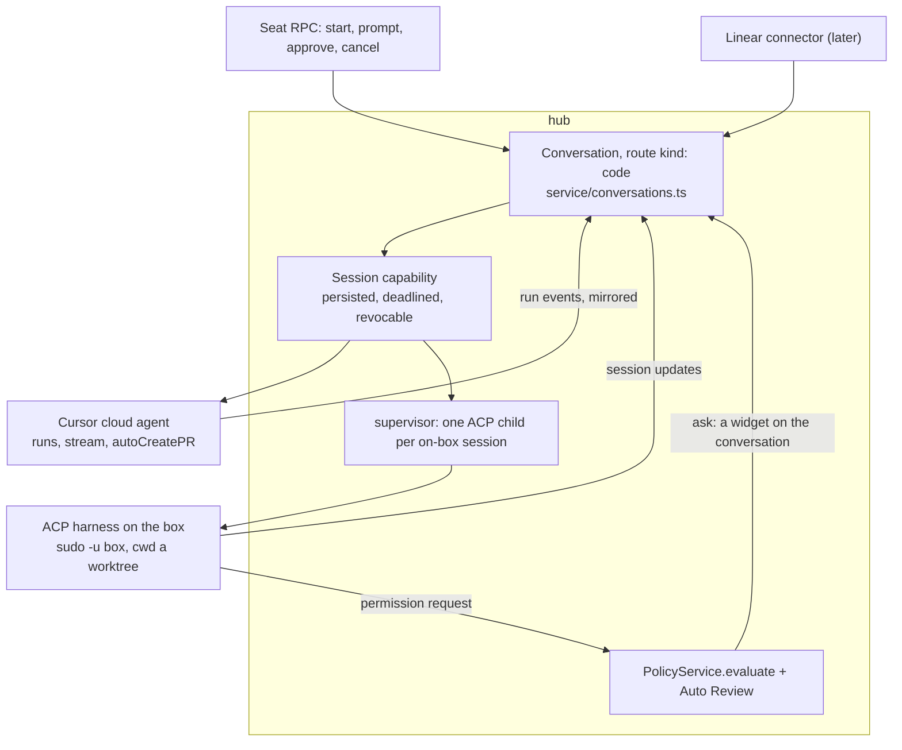

# Coding sessions: what runs the work, who owns the record

Plan date: 2026-09-04. Companion to [`../ARCHITECTURE.md`](../ARCHITECTURE.md) (why the pieces are cut where they are), [`conversations.md`](conversations.md) (the record this builds on), [`../GROK-BOT.md`](../GROK-BOT.md) (what the product being cloned actually does) and [`../../api/DESIGN.md`](../../api/DESIGN.md) (the five tools and the shell contract). This document is an overview and a recommendation rather than an implementation plan: it says which of the available shapes to buy, what each one actually owns, and what the box forces on any of them. The delegated half of that recommendation has since shipped (`apps/hub/src/service/coding.ts`, section 6); the on-box half has not.

## 1. The question is three questions

Every product that ships "coding sessions" ships three separable decisions bundled into one word, and the way to lose a week is to buy one of the three and inherit the other two by accident.

**The record.** Who owns the session object, its states and its ordered activity log. Linear's `AgentSession`, Cursor's durable agent plus its runs, an eve session keyed `<token>#<uuid>`, or a hub conversation.

**The runtime.** What actually reads the repo, edits files and runs the tests. The Claude Code CLI, the Codex CLI, Cursor's cloud VM, Linear's hosted runner, or the desk Bot driving its own five tools.

**The gate.** Who decides a command may run, and where a human gets asked. `PolicyService.evaluate` plus Auto Review plus the seat, Codex's OS-level sandbox, a provider's org settings, or nothing.

Held apart, the candidates stop competing and start slotting into different rows.

| Option                                                                     | Record                                     | Runtime                                  | Gate                                | What it costs                                                        |
| -------------------------------------------------------------------------- | ------------------------------------------ | ---------------------------------------- | ----------------------------------- | -------------------------------------------------------------------- |
| [Cursor cloud agents](https://cursor.com/docs/cloud-agent/api/endpoints)   | theirs (`agent` + `run`)                   | theirs (cloud VM)                        | theirs, plus ours at the boundaries | a second activity log to mirror; no box, which is mostly the point   |
| [Linear agent sessions](https://linear.app/developers/agent-interaction)   | theirs, and it is the best-specified one   | ours or theirs                           | ours                                | a connector to build; a 10 s acknowledgement deadline                |
| Eve coding session                                                         | eve's, already rendered in `chat-pane.tsx` | the desk Bot's five tools                | ours, already                       | a computer-use agent with a repo, capped by a 120 s `shell`          |
| [AI SDK `HarnessAgent`](https://ai-sdk.dev/providers/ai-sdk-harnesses)     | theirs (session + stream)                  | Claude Code, Codex, Cursor, OpenCode, Pi | the harness's, unless adapted       | AI SDK 7 beside eve, and their sandbox providers                     |
| A harness on the box over [ACP](https://docs.openclaw.ai/tools/acp-agents) | ours (a conversation)                      | Claude Code, Codex, Cursor CLI, others   | ours, carried as protocol messages  | a supervised child per session; a Machine pinned awake while it runs |

## 2. What the box forces before anything is chosen

Six facts, each already in the tree, and each one narrows the field.

**The hub is the only door and the only gate.** A CLI started as `box` under the supervisor has its own bash, its own file writes and its own network, and `PolicyService` never sees any of it. That is a fifth door absent from the table in [`ARCHITECTURE.md`](../ARCHITECTURE.md) section 4, and it is the single hardest constraint here: an unadapted coding harness on this box is a bypass of policy, of Auto Review, of the seat FSM and of the audit trail, all at once, installed by us.

**`shell` is 1 to 120 seconds, `cwd` under `/workspace`, idempotent by `request_id`** (`api/DESIGN.md`, "Shell and files"). A coding session is minutes to hours. It cannot be an RPC call; it is a process with a lifecycle, which means the supervisor, not the request path.

**The five tools are the whole model surface.** `api/DESIGN.md` refuses a sixth because a tool is reach, and `conversations.md` already re-argued it for a conversation target. A `start_coding_session` tool is the same widening in a new coat.

**The Machine is the only isolation boundary.** A coding session on the tenant box shares `/workspace`, the `box` uid, the browser profile and the desk agent's screen. A git worktree per session is hygiene, not containment, and it should never be described as more.

**There is no egress policy** ([`ARCHITECTURE.md`](../ARCHITECTURE.md) section 7). A computer-use agent that exfiltrates has to be talked into it; a coding agent pushing to a remote is doing its job.

**A tenant Machine suspends when idle** ([`gateway.md`](gateway.md)). A running session pins it awake, bounded by the session's own deadline rather than permanently, but a session with no deadline is a Machine that never sleeps.

Read together those six do not merely constrain an on-box session, they argue against making it the default. Every one of them is a cost that disappears when the coding runs somewhere that is not this box.

One smaller fact, easy to miss and load-bearing later. `TurnService` (`apps/hub/src/service/turns.ts`) holds turns in memory with a 150 second TTL, chosen to match Eve's own hub client timeout. A coding session outlives that by orders of magnitude and outlives a hub restart. Whatever binds a session's appends to a conversation is a persisted, revocable, hours-deadlined capability, not a turn token. Reuse the shape, not the instance.

## 3. Prior art, and what each one settled

Four projects have already answered parts of this, and three of them answered it the same way.

**Grok Bot delegates coding off the box, and this repository has already written that down.** [`GROK-BOT.md`](../GROK-BOT.md) records it in one line: "Cursor Cloud Agents can be spawned for coding so repo work does not contend with the bot VM." The product whose shape this repo is chasing runs a persistent computer for computer use and does not do its coding there. The confirming detail is in the iOS client, already screenshotted in `docs/reference/`: a task card carries a title, a status pill, the branch and PR number, the file and line delta, and **View PR / Open in Cursor** actions. The client's coding UI is already the UI of a delegated session. Field reports say it works well, which is the kind of evidence that should move a design.

**[Hermes Agent](https://github.com/nousresearch/hermes-agent) made the machine a backend rather than an assumption.** It runs on six terminal backends, local, Docker, SSH, Daytona, Singularity and Modal, and its own docs note that Daytona and Modal hibernate when idle so an environment costs nearly nothing while nothing is running. That is the same economics as Fly suspend, chosen deliberately, and it is the strongest available argument that "where the code runs" should be a setting rather than a fact of the architecture. Its profiles system, one agent per profile with its own config, identity document, memory store, gateway process and cron definitions, is close enough to a Bot here to be worth reading before Phase 7 of the roadmap.

**[OpenClaw's code-agent plugin](https://github.com/goldmar/openclaw-code-agent) is the closest thing to a working version of what section 5 proposes, and it is worth copying rather than re-deriving.** It runs Claude Code, Codex and experimental OpenCode as managed background coding sessions started from chat, each backend with its own adapter and resume substrate behind shared tools, routing and notification pipeline. Three of its decisions are directly transplantable. `defaultWorktreeStrategy` is `delegate`, `ask`, `off`, `auto-merge` or `auto-pr`, so branch follow-through is a policy rather than an improvisation, and in `ask` mode it is a widget with **Merge**, **Open PR**, **Later**, **Discard**, which the hub's existing 1 to 6 option `widget` renders unchanged. The default policy is review-first, `permissionMode: "plan"` with `planApproval: "delegate"`, so a plan is approved before implementation and `Approve`, `Revise` or `Reject` in the same thread continues the same session rather than starting a duplicate. And follow-ups, approvals, interrupts and redirects all take one continuation path, which is the thing that is easy to get wrong and expensive to fix later. OpenClaw 2.0 additionally makes sessions shareable, so a task can be handed from one person to another with its context intact.

**ACP is the part that changes this document's recommendation.** OpenClaw does not parse each CLI's stdout; it speaks the [Agent Client Protocol](https://docs.openclaw.ai/tools/acp-agents), with harness targets including `claude`, `codex`, `copilot`, `cursor`, `gemini`, `droid`, `opencode` and a dozen more, driven through `sessions_spawn()` with `runtime: "acp"`. The division of labour it names is exactly the one section 1 asks for: the caller owns routing, background-task state, delivery, bindings and policy, while the harness keeps provider login, model catalog, filesystem behaviour and native tools. And what the protocol carries is sessions with resume, streaming updates, and **permission requests as structured messages**, including form inputs, URL approval prompts and secret fields. The AI SDK's adapter list names it too. That matters here more than anywhere else: a permission request arriving as a protocol message rather than a CLI-specific hook is the gate seam as a first-class object, and secret fields land straight on `ProvideSecret`, which already exists.

## 4. The two runtimes, and the line between them

The revision this prior art forces: **delegated is the default, on-box is the exception, and the exception is defined by what the work needs rather than by preference.**

Send it to a Cursor cloud agent when the task is repo in, pull request out. `POST /v1/agents` with a prompt and a GitHub URL, `POST /v1/agents/{id}/runs` to enqueue, a stream endpoint, a cancel, and `autoCreatePR` to land it, on Bearer or Basic auth. That is most coding work, it does not contend with the desk, it does not pin a Machine awake, and it cannot bypass a policy gate on a box it never touches. The cost is real and narrow: a second activity log, which the hub mirrors into the conversation so hello.expert and iOS keep reading one record.

Run it on the box when the work needs the box. Three cases, and they are not hypothetical: this repository itself, where a change is followed by `fly deploy` and a health check; anything that needs the signed-in browser profile or the desk to verify what it built; and anything touching `/workspace` state that exists nowhere else. For those, off-box is not cheaper, it is impossible.

When it is on the box, speak ACP rather than scripting a CLI. The alternative, parsing `claude -p --output-format stream-json` and hanging approvals off a `PreToolUse` hook or `--permission-prompt-tool`, works and was this document's first recommendation, but it buys one harness and a bespoke gate seam for roughly the same effort as buying every harness and a specified one. Codex remains worth noting for the thing it has that nothing else here does, `--sandbox` with `read-only` and `workspace-write` as real OS-level containment, which is the specification for what a desk-side sandbox should eventually enforce even while the box does not have one.

There is a credential problem underneath the on-box path, worth stating before it is discovered. `AGENTS.md` says secrets never land in the environment of a child the model can reach, and a coding child started through `asBox` is exactly such a child: the model's `shell` runs as the same uid, so `/proc/<pid>/environ` is readable and the harness's API key is not a secret from the model. The fixes are a third uid for coding children, which is a desk image change, or brokering the model call through the hub. Neither is free, and shipping without one means the box's own agent can lift the credential. Delegated sessions do not have this problem at all, which is one more entry on the same side of the ledger.

## 5. One record, one gate, two runtimes

**The record** is the existing conversation store with `route: { kind: "code", … }` beside `seat`, `whatsapp` and `peer`, holding both runtimes. Session state uses Linear's six values (`pending`, `active`, `error`, `awaitingInput`, `complete`, `stale`) and its activity types (`thought`, `action`, `response`, `elicitation`, `error`), so a Linear connector is later a rename rather than a translation layer, and the mapping to what exists is already close: `awaitingInput` is `turnEnded`, `elicitation` is `widget` and `secret_request`, `response` is what `send_message` writes today, `action` is what nothing records yet. Messages land in the hub-owned log at `/workspace/.computer/conversations/<id>.jsonl`, which the model cannot write.

**The gate** stays ours in both runtimes, and it is only the same gate because the record is. On-box, an ACP permission request runs `PolicyService.evaluate` and an `ask` verdict becomes a widget on the conversation. Delegated, the box has no say in what runs inside Cursor's VM, so the gate moves to the boundaries that matter anyway: starting the session, approving the plan, and merging, opening a PR or deploying. Copy OpenClaw's defaults for both, review-first with plan approval, and a worktree or branch strategy that is `ask` until someone chooses otherwise.

**Who may start one.** A Seat RPC for a human, a connector inbound for Linear or WhatsApp. Not a model tool: the desk Bot delegates by speaking into a peer conversation, which is `conversations.md` phase 3, and until that exists the desk Bot cannot start a coding session at all. That is the right default rather than a gap.

## 6. Order of work

The tracer bullet was the delegated one, because it is smaller and it is the shape the iOS client already draws, and **it has landed**: `apps/hub/src/service/coding.ts`, a `code` route on the conversation, and two Seat RPCs (`StartCodingSession`, `RefreshCodingSession`) documented in `api/DESIGN.md`, with `Seat.Conversations` doing the listing because a session is a conversation. A session started from a seat launches through `POST /v1/agents`, the prompt is recorded as the human's own words, each status change is one `system` line, and a finished run carries its branch and pull request into the same thread `Seat.Occurrences` already pages. No new message body, so every client that renders a conversation renders a coding session. Off without `CURSOR_API_KEY`, and that key is in the supervisor's `DENY` set so it never reaches a child the model shares a uid with.

What the tracer deliberately left: the session is polled rather than streamed, and nothing yet cancels one. Both are small, and both were left because the record is the half that had to be right first.

Then, in order: the persisted session capability with a real deadline; the on-box ACP runtime behind the same conversation, tracer being `claude` over ACP against this repository with every permission request gated by `PolicyService`; worktree strategy and plan approval as widgets; the Linear connector; and per-session containment only with a trigger, which is a session against a repo the tenant does not own.

## 7. What is deliberately not there

**`HarnessAgent`.** Once ACP is the wire, an SDK-shaped wrapper over the same harnesses buys a sandbox-provider abstraction whose providers are not this box. Trigger: a verified way to implement that interface for a Fly Machine.

**A Cursor-shaped fallback for the box.** Delegated and on-box are different runtimes for different work, not a failover pair. A task that needs the box and cannot run there fails visibly.

**Per-session isolation claims.** A worktree is not a sandbox and should not be described as one in the UI. Real isolation is a second Machine, because that is the only isolation boundary this system has.

**Egress controls.** Still the honest gap. On-box coding sessions sharpen it rather than create it, which is one more reason the default runs off the box.

**A second read RPC.** `Seat.Occurrences` with a `conversation_id` is the read view, for the reason `conversations.md` already gives.

## 8. How to tell it worked

A session started from a seat produces a branch with a real diff, and hello.expert and iOS render it from the hub's own conversation rather than from a provider's log. An `ask` verdict during an on-box session reaches a human as a widget and blocks the child until answered. A plan is approved before implementation, and `Approve`, `Revise` or `Reject` continues one session rather than starting a second. Killing the hub mid-session leaves the session resumable or cleanly failed, never silently orphaned holding a Machine awake. And the model's own `shell` cannot read the session's log, its worktree metadata, or the harness credential.
