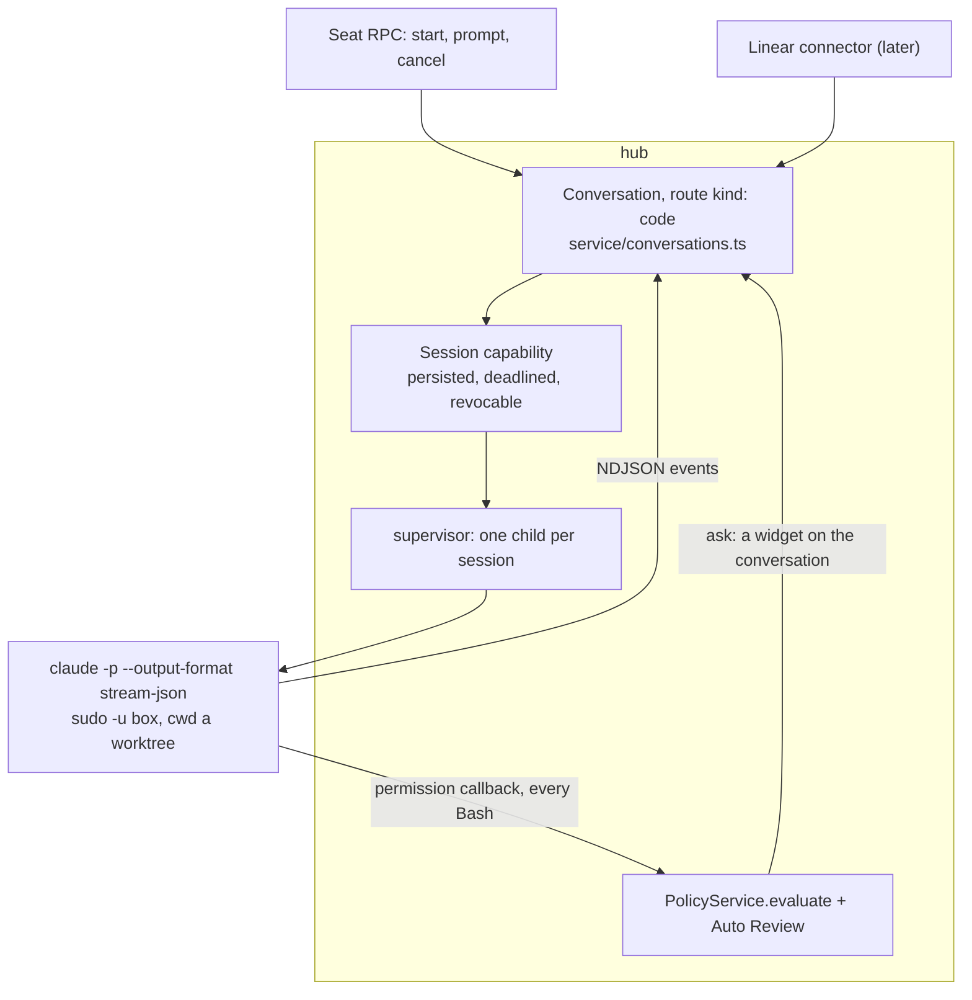

# Coding sessions: what runs the work, who owns the record

Plan date: 2026-09-04. Companion to [`../ARCHITECTURE.md`](../ARCHITECTURE.md) (why the pieces are cut where they are), [`conversations.md`](conversations.md) (the record this builds on) and [`../../api/DESIGN.md`](../../api/DESIGN.md) (the five tools and the shell contract). Nothing here is written yet. This document is an overview and a recommendation, not an implementation plan: it says which of four shapes to buy, what each one actually owns, and what the box forces on any of them.

## 1. The question is three questions

Every product that ships "coding sessions" ships three separable decisions bundled into one word, and the way to lose a week is to buy one of the three and inherit the other two by accident.

**The record.** Who owns the session object, its states and its ordered activity log. Linear's `AgentSession`, Cursor's durable agent plus its runs, an eve session keyed `<token>#<uuid>`, or a hub conversation.

**The runtime.** What actually reads the repo, edits files and runs the tests. The Claude Code CLI, the Codex CLI, Cursor's cloud VM, Linear's hosted runner, or the desk Bot driving its own five tools.

**The gate.** Who decides a command may run, and where a human gets asked. `PolicyService.evaluate` plus Auto Review plus the seat, Codex's OS-level sandbox, a provider's org settings, or nothing.

Held apart, the four candidates stop competing and start slotting into different rows.

| Option                                                        | Record                                              | Runtime                                   | Gate                                             | What it costs                                                             |
| ------------------------------------------------------------- | ---------------------------------------------------- | ------------------------------------------ | ------------------------------------------------- | -------------------------------------------------------------------------- |
| [Cursor cloud agents](https://cursor.com/docs/cloud-agent/api/endpoints) | theirs (`agent` + `run`)                   | theirs (cloud VM)                          | theirs                                            | the box contributes nothing; a second audit trail nobody reads             |
| [Linear agent sessions](https://linear.app/developers/agent-interaction) | theirs, and it is the best-specified one | ours or theirs                             | ours                                              | a connector to build; a 10 s acknowledgement deadline                      |
| Eve coding session                                            | eve's, already rendered in `chat-pane.tsx`          | the desk Bot's five tools                 | ours, already                                     | a computer-use agent with a repo, capped by a 120 s `shell`                |
| [AI SDK `HarnessAgent`](https://ai-sdk.dev/providers/ai-sdk-harnesses) | theirs (session + stream)          | Claude Code, Codex, Cursor, OpenCode, Pi | the harness's, unless adapted                     | AI SDK 7 beside eve, and their sandbox providers                           |
| A CLI on the box                                              | ours (a conversation)                               | Claude Code or Codex                       | ours, but only if the CLI's approvals are adapted | a fifth door if the gate is skipped; a supervised child per session        |

## 2. What the box forces before anything is chosen

Six facts, each already in the tree, and each one narrows the field.

**The hub is the only door and the only gate.** A CLI started as `box` under the supervisor has its own bash, its own file writes and its own network, and `PolicyService` never sees any of it. That is a fifth door absent from the table in [`ARCHITECTURE.md`](../ARCHITECTURE.md) section 4, and it is the single hardest constraint here: an unadapted coding harness on this box is a bypass of policy, of Auto Review, of the seat FSM and of the audit trail, all at once, installed by us.

**`shell` is 1 to 120 seconds, `cwd` under `/workspace`, idempotent by `request_id`** (`api/DESIGN.md`, "Shell and files"). A coding session is minutes to hours. It cannot be an RPC call; it is a process with a lifecycle, which means the supervisor, not the request path.

**The five tools are the whole model surface.** `api/DESIGN.md` refuses a sixth because a tool is reach, and `conversations.md` already re-argued it for a conversation target. A `start_coding_session` tool is the same widening in a new coat.

**The Machine is the only isolation boundary.** A coding session on the tenant box shares `/workspace`, the `box` uid, the browser profile and the desk agent's screen. A git worktree per session is hygiene, not containment, and it should never be described as more.

**There is no egress policy** ([`ARCHITECTURE.md`](../ARCHITECTURE.md) section 7). A computer-use agent that exfiltrates has to be talked into it; a coding agent pushing to a remote is doing its job. This is the option that turns that absence from a known gap into a live one, and the trade should be taken with eyes open rather than discovered later.

**A tenant Machine suspends when idle** ([`gateway.md`](gateway.md)). A running session pins it awake. Unlike the WhatsApp socket that is bounded by the session's own deadline, so it is a cost per session rather than a permanent floor, but a session with no deadline is a Machine that never sleeps.

One more, smaller and easy to miss. `TurnService` (`apps/hub/src/service/turns.ts`) holds turns in memory with a 150 second TTL, chosen to match Eve's own hub client timeout. A coding session outlives that by orders of magnitude and outlives a hub restart. So the binding a coding session needs is not a turn token: it is a session-scoped capability that is persisted, revocable, and deadlined in hours. Reuse the shape, not the instance.

## 3. The four options, read honestly

**Cursor cloud agents** own all three rows. `POST /v1/agents` with a prompt and a GitHub URL, `POST /v1/agents/{id}/runs` to enqueue work, a stream endpoint, a cancel, and `autoCreatePR` to land it. Bearer or Basic with an API key. It is the cheapest way to have coding sessions tomorrow and it is genuinely good at the thing it does, which is repo in, pull request out. It is also the option where the computer is a client of somebody else's box: no screen, no `/workspace`, no signed-in browser, no WhatsApp identity, and a second activity log that hello.expert does not render. Correct for fan-out work that only needs a repo and a PR. Wrong as the primary shape, because it makes the box irrelevant to the one workload people most want on it.

**Linear is not a runtime to borrow, it is the interaction protocol to copy.** An `AgentSession` is created when the agent is mentioned or delegated an issue, and its states are `pending`, `active`, `error`, `awaitingInput`, `complete` and `stale`. Agents emit `AgentActivity` of type `thought`, `action`, `response`, `elicitation` or `error`, and `prompt` is the user's side, which agents cannot author. Events arrive by webhook as `AgentSessionEvent` with actions `created` and `prompted`, and a `created` event must be answered with an activity within ten seconds or the session is marked unresponsive. Read that against `conversations.md` and the overlap is close to total: `awaitingInput` is the `turnEnded` flag, `elicitation` is `widget` and `secret_request`, `response` is what `send_message` writes today, `action` is what nothing records yet. Linear also runs its own hosted coding sessions, and that half is a competitor to the runtime row rather than something to integrate. The useful move is to treat Linear as a fifth connector kind, inbound, hub-minted secret, exactly as WhatsApp is, and to steal its state and activity vocabulary for the hub's own record so that the connector is later a rename rather than a translation layer.

**An eve coding session is the cheapest thing that could work, and its ceiling is low.** One channel file, one skill, and the session already exists with an event stream that `apps/web/components/chat-pane.tsx` already renders. Nothing new in the hub at all. What it buys is a desk agent that can be asked to change a file and redeploy. What it cannot become is a coding agent: the model driving it is tuned for computer use, its `shell` dies at 120 seconds so a test suite or an install is a series of resumptions, and it has no diff, no patch, no repo state and no compaction strategy for a long edit loop. Ship it if the requirement is "fix a typo in the instructions and rebuild". Do not ship it as the answer to "implement this issue".

**`HarnessAgent` is an adapter, and adapters are worth buying when there are at least two things to adapt.** AI SDK 7 exposes `new HarnessAgent({ harness, model, sandbox })` over Claude Code, Codex, Cursor, OpenCode, Pi, Cline, fx, Grok Build and the Agent Client Protocol, with sandbox providers such as `createVercelSandbox` supplying the machine, so nobody scripts a CLI's stdio or babysits a sandbox lifecycle. Real value, in the shape of a dependency. Against it here: eve is already the agent runtime in this tree, the sandbox providers on offer are theirs and not this box, and the whole point of running on the computer is that the sandbox is the tenant's own Machine. The version of this that would be interesting is the box as a sandbox provider behind that interface, which would make harness choice a config line. Whether that interface is public and implementable from outside is unverified and would need a spike before anybody plans around it. Until then, this is a second harness's problem, and there is not yet a first.

## 4. Codex CLI or Claude Code CLI on the box

The comparison that matters here is not which writes better code. It is which one can be put behind the gate the hub already has.

**Claude Code** runs non-interactively with `-p` / `--print` and `--output-format stream-json`, emitting newline-delimited events, with `--resume` for continuing a session, `--allowedTools` to narrow the surface, and `--permission-mode` for unattended runs. The load-bearing feature is that its approvals can be routed to an external decider rather than to a terminal: a `PreToolUse` hook, or `--permission-prompt-tool` pointing at an MCP tool the CLI consults before running anything. That is the seam onto `PolicyService.evaluate`, and through it onto Auto Review and onto the seat's human. Approvals from a coding session then land in the same place the desk agent's approvals already land, which is the whole ballgame.

**Codex** has a purpose-built non-interactive subcommand, `codex exec --json`, emitting newline-delimited events with a real exit code and `--output-last-message` for the final text. Its distinguishing feature is the other one: `--sandbox` with `read-only`, `workspace-write` and `danger-full-access` is OS-level containment that this box does not otherwise have anywhere. But `exec` is designed not to stop and ask, so the gate becomes a policy chosen once at launch rather than a decision a human can answer mid-run.

So the split is clean. Codex brings containment and a coarse gate; Claude Code brings a fine gate and no containment. The box needs the gate more, because per-session containment on a shared `/workspace` under a shared uid is a claim that would not survive being tested, while a bypassed `PolicyService` is a regression against something that works today. Start with Claude Code as the runtime, and treat Codex's `--sandbox workspace-write` as the specification for what a desk-side sandbox should eventually enforce. Both on the guest image is two credentials and two update paths for one job; pick one.

There is a credential problem underneath this that is worth stating before it is discovered. `AGENTS.md` says secrets never land in the environment of a child the model can reach, and a coding child started through `asBox` is exactly such a child: the model's `shell` runs as the same uid, so `/proc/<pid>/environ` is readable and the harness's API key is not a secret from the model. The fixes are a third uid for coding children, which is a desk image change, or brokering the model call through the hub so the child never holds a key. Neither is free, and shipping without one means the box's own agent can lift the credential.

## 5. The shape that fits

A coding session is a conversation with a new route kind and a supervised child process. No new model tool, no new storage subsystem, no second activity log.

**The record** is the existing conversation store with `route: { kind: "code", repo, ref, worktree }` beside `seat`, `whatsapp` and `peer`. The harness's NDJSON becomes `Message`s in the hub-owned log at `/workspace/.computer/conversations/<id>.jsonl`, which the model cannot write, with the activity kinds named after Linear's so the connector is later a rename. Session state is Linear's six values on the conversation.

**The runtime** is one child per session under `apps/hub/src/host/supervisor.ts`, the same supervisor that already runs eve and the bridge with backoff and health probes, started through the `asBox` seam with `cwd` a git worktree under `/workspace/code/<session>`.

**The gate** is the harness's permission callback posting back to the hub, which runs the same `PolicyService.evaluate` the model's `shell` goes through. An `ask` verdict becomes a `widget` on the conversation, which is a mechanism that already exists and already reaches a human on whichever surface is watching. A design where the child runs ungated is not a smaller version of this; it is a different and worse system.

**Who may start one.** A Seat RPC for a human, a connector inbound for Linear or WhatsApp. Not a model tool: the desk Bot delegates by speaking into a peer conversation, which is `conversations.md` phase 3, and until that exists the desk Bot cannot start a coding session at all. That is the right default rather than a gap.

## 6. Order of work

The tracer bullet: one session, started from a seat, against this repo, running `claude -p --output-format stream-json` as a supervised child; its events land as messages in a `code` conversation; every tool call it makes is gated by `PolicyService`; it ends with a diff on a branch. Nothing else. If that does not land clean, the shape is wrong and none of the rest should be written.

After that, in order: worktrees and cancel and resume; the persisted session capability with a real deadline, and what a Machine suspend does to a running child; PR creation; the Linear connector; and only with a named trigger, fan-out to Cursor cloud for work that does not need the box. The trigger for that last one is a queue of repo-only tasks that would otherwise pin the Machine awake, not a preference.

## 7. What is deliberately not there

**`HarnessAgent`.** Trigger: a second harness actually wanted in the same product surface, or a verified way to make the box a sandbox provider behind that interface. One CLI does not need an abstraction over CLIs.

**Per-session isolation.** A worktree is not a sandbox and should not be described as one in the UI. Trigger for real isolation: a session run against a repo whose contents the tenant does not own, at which point it is a second Machine, because that is the only isolation boundary this system has.

**Egress controls.** Still the honest gap, and coding sessions make it sharper rather than creating it. Named here so that the first tenant whose code is not their own is a decision rather than a surprise.

**A second read RPC.** `Seat.Occurrences` with a `conversation_id` is the read view, for the reason `conversations.md` already gives.

## 8. How to tell it worked

A session started from a seat produces a branch with a real diff, and every command it ran appears in the hub's log with a policy verdict beside it. An `ask` verdict during a session reaches a human as a widget and blocks the child until answered. Killing the hub mid-session and restarting it leaves the session either resumable or cleanly failed, never silently orphaned holding a Machine awake. And the model's own `shell` cannot read the session's log, its worktree metadata, or the harness credential.
